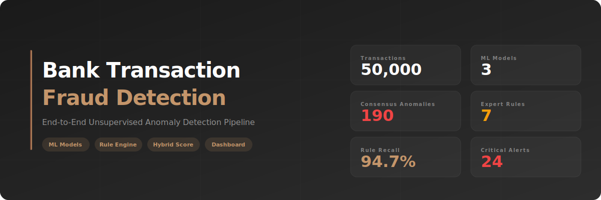

<p align="center">
  
</p>

<p align="center">
  
  
  
  
  
</p>

# Bank Transactions Fraud Detection

End-to-End Unsupervised Fraud Detection Pipeline — EDA, Feature Engineering, Anomaly Detection, Rule Engine, Hybrid Scoring & Interactive Dashboard

## Live Presentation

> **[View Interactive Presentation](https://natpaphonnn.github.io/Bank-Transactions-Fraud-Detection/presentation.html)** — Banking-themed website with 3D globe, interactive charts, and scroll animations

## Quick Start

```bash
# Clone the repository
git clone https://github.com/Natpaphonnn/Bank-Transactions-Fraud-Detection.git
cd Bank-Transactions-Fraud-Detection

# Install dependencies
pip install -r requirements.txt

# Launch the interactive dashboard
streamlit run dashboard.py
```

## Project Structure

| File | Description |
|------|-------------|
| `01_EDA_Bank_Transactions.ipynb` | Exploratory Data Analysis — data overview, distributions, anomaly indicators |
| `02_Feature_Engineering_and_Anomaly_Detection.ipynb` | Feature Engineering (~30 features) + 3 Anomaly Detection models |
| `03_Model_Evaluation_and_Comparison.ipynb` | Model evaluation, comparison, sensitivity analysis & business insights |
| `04_Rule_Based_Engine.ipynb` | 7 expert fraud rules + Hybrid Risk Score (ML + Rules) |
| `05_Final_Report.ipynb` | Executive Summary — full pipeline results & recommendations |
| `dashboard.py` | Interactive Streamlit Dashboard with Live Monitor (`streamlit run dashboard.py`) |
| `presentation.html` | Interactive presentation website (banking theme, 3D globe, Chart.js) |
| `bank_transactions.csv` | Raw dataset — 50,000 synthetic bank transactions |

## Key Findings

- **50,000 transactions** from **495 accounts** across **43 US cities** (2020–2025)
- **190 consensus anomalies** identified by 2+ ML models
- **94.7% recall** — rule engine catches nearly all ML-detected anomalies
- **Login ≥ 3 attempts** = strongest risk driver (+164% risk premium)
- **Amount-to-Balance ratio** is 527% higher in anomalies vs normal transactions

## Pipeline Architecture

```
Raw Data → EDA → Feature Engineering → ML Models → Rule Engine → Hybrid Score
(50K txn)         (~30 features)     (ISO+DBSCAN    (7 rules)    (ML + Rules)
                                      +LOF)
```

## Models & Approach

| Model | Anomalies | Best Metric |
|-------|-----------|-------------|
| Isolation Forest | 2,500 (5.0%) | Silhouette: 0.39, CH: 2,208 |
| DBSCAN | 24 (0.05%) | DBI: 1.23 (most precise) |
| LOF | 2,500 (5.0%) | Local density detection |

## Hybrid Risk Scoring

```
Hybrid Score = 0.5 × ML Score + 0.5 × Rule Score
```

| Risk Level | Count | % |
|------------|-------|---|
| Low | 22,352 | 44.7% |
| Medium | 24,596 | 49.2% |
| High | 3,028 | 6.1% |
| Critical | 24 | 0.05% |

## Rule Engine (7 Rules)

| Rule | Trigger Rate | Severity |
|------|-------------|----------|
| Login Attempts ≥ 3 | 3.85% | Critical |
| Device shared ≥ 5 accounts | 45.92% | Critical |
| Amount Z-Score > 2 | 3.39% | High |
| Amount/Balance > 0.8 | 5.62% | High |
| Multi-location (8+ cities) | 18.79% | High |
| Rapid transaction (< 1hr) | 2.41% | Medium |
| High velocity (3+ txn/day) | 0.12% | Medium |

## Dashboard Features

- **Overview** — KPIs, risk distribution, channel & occupation analysis
- **Account Drill-Down** — Per-account investigation with transaction timeline
- **Rule Engine** — Rule trigger analysis and severity breakdown
- **Risk Explorer** — Interactive scatter plots (Amount vs Risk, ML vs Rules)
- **Live Monitor** — Real-time fraud detection simulation with alert feed

## Tech Stack

| Category | Tools |
|----------|-------|
| Data & ML | Python, Pandas, NumPy, Scikit-learn |
| Visualization | Matplotlib, Seaborn, Plotly, Chart.js |
| Dashboard | Streamlit |
| Presentation | HTML/CSS/JS, Three.js (3D Globe), Chart.js |
| CI/CD | GitHub Actions |
